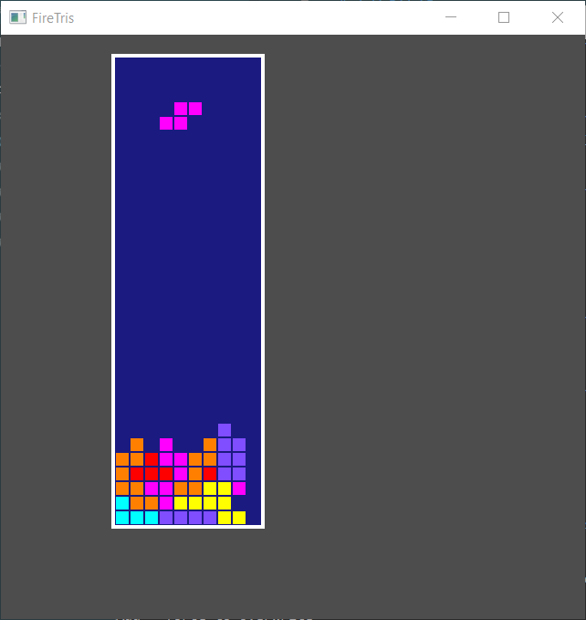

# FireTris

A Tetris clone written in Rust using the Piston game engine.

Written as an exercise in learning Rust.

The game looks like this:

Press return to start a game, use the arrow keys and space to control the pieces.

TODO-list:

  - Detect game over and allow starting a new game
  - Track the player's score
  - Progressively increase difficulty
  - Prettier graphics
  - Display the upcoming piece
  - Let the player store a piece
